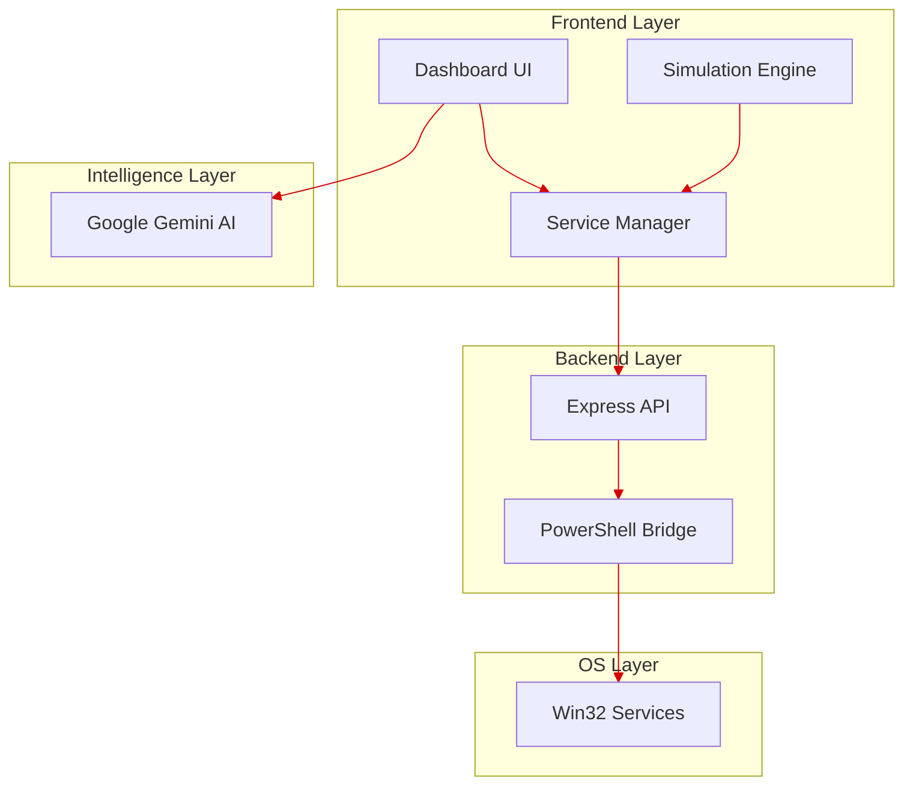

# 🛰️ REBOOTMASTER-DASHBOARD | Technical Architecture

> **High-Availability Monitoring and Automated Service Recovery for Windows**

---

## 🚀 Getting Started

To start the entire system (Frontend + Backend) with zero-configuration:

1.  **Install Dependencies**:
    ```bash
    # Root directory
    npm install
    # Server directory
    cd server && npm install
    ```

2.  **Start Development**:
    ```bash
    npm run dev
    ```
    - **Zero-Config**: The `predev` hook automatically runs `ensure-certs.ps1`.
    - **Auto-Certs**: Certificates (PEM/PFX) are generated on-the-fly if missing.
    - **Endpoints**:
        - **Frontend**: `https://localhost:3000`
        - **Backend**: `https://localhost:3001`

---

## ⌨️ Manual Setup & Configuration

### Custom Certificate Generation
If you prefer to generate certificates manually or use your own, place them in `server/certs/`:

- **OpenSSL (Generic PEM)**:
  ```bash
  openssl req -x509 -newkey rsa:4096 -keyout server/certs/key.pem -out server/certs/cert.pem -nodes -days 365 -subj "/CN=localhost"
  ```
- **PowerShell (PFX Container)**:
  The system uses `cert.pfx` with the default password `password`.

---

## 🔒 Security Layer (HTTPS Toggle)

The system supports a dynamic security layer that can be toggled using environment variables.

-   **Environment Variable**: `USE_HTTPS` (defaults to `true`). Set to `false` in `.env` to disable.
-   **Automation Script**: [`ensure-certs.ps1`]
    -   **Execution Strategy**: Prioritizes OpenSSL (via Git Bash/System Path) for standard PEM generation. Falls back to native `New-SelfSignedCertificate` on Windows systems without OpenSSL.
    -   **PFX Conversion**: Automatically packages PEM files into a `.pfx` container for native Node.js/Windows compatibility.
    -   **Cert Password**: All automated PFX exports use `password` as the passphrase for development consistency.
-   **Server Logic**:
    -   **Backend**: `server.js` checks filesystem for `cert.pfx` or `cert.pem`/`key.pem` pairs. It initializes `https` only if `USE_HTTPS` is `true` AND files are present.
    -   **Frontend**: Vite config injects SSL configuration into the dev server dynamically.
    -   **Proxy**: Automatically detects protocol (http/https) to update the `target` URL for API requests.

---

## ⚙️ Environment Management

The application uses `dotenv` to manage configurations across different environments.

-   **Priority**: `.env.local` variables take precedence over `.env`.
-   **Security**: All sensitive credentials (like `GEMINI_API_KEY`) MUST be stored in `.env.local`.
-   **Structure**: 
    -   `USE_HTTPS`: Master toggle for secure communication.
    -   `GEMINI_API_KEY`: Required for the AI-powered diagnostic features.

```env
GEMINI_API_KEY=PLACEHOLDER_API_KEY
```

---

## 🏗️ System Architecture [https://mermaid.live/]
 -  Frontend Layer (Vite + React)
 - Backend Layer (Node.js + Express)
 - OS Layer (Windows)
 - Intelligence Layer



---

## 📊 Core Inventory

| Module | Purpose | File |
| :--- | :--- | :--- |
| **Logic Hub** | Global state & Simulation engine | [App.tsx] |
| **Admin Panel** | CRUD, Import/Export & Discovery | [ServiceManager.tsx] |
| **Service Bridge** | OS-level PowerShell execution | [server.js] |
| **AI Diagnostics** | Gemini Flash 2.5 Log Analysis | [AIAnalysisModal.tsx] |

---

## 🔍 Detailed Component Analysis

### 📡 **Backend: The PowerShell Bridge**
#### `server.js`
The backend acts as a specialized gateway. It uses Node's `child_process` to pipe requests directly into the Windows Management Instrumentation (WMI) via PowerShell.
- **Dynamic Enumeration**: On-demand scanning of all installed Win32 services.
- **Buffering**: Optimized `maxBuffer` handling to process large output from hundreds of system services.

### 🧠 **Frontend: The Orchestration Layer**
#### `App.tsx`
This is the "Brain" of the application.
- **Heartbeat Loop**: Runs a continuous monitoring check (adjustable interval) to verify service health.
- **Recovery Logic**: Automatically transitions services from `FAILED` to `RESTARTING` based on configured thresholds.

#### `ServiceManager.tsx`
A robust interface for service lifecycle management.
- **Smart Filtering**: The `filterExternalServices` function applies a whitelist/blacklist approach:
    - **Hidden Paths**: `C:\Windows`, `C:\Program Files`, `C:\ProgramData`.
    - **Rationale**: To reduce "system noise" and focus exclusively on user-installed applications.
- **Bulk Actions**: Support for importing complex monitoring topologies via JSON.

#### `Dashboard.tsx` & `LogViewer.tsx`
The visualization suite.
- **Metrics**: Real-time aggregation of uptime percentages and failure counts.
- **Event Stream**: A high-performance log terminal with built-in hooks for AI analysis.

---

## ⚡ Data Flow Pipeline

1.  **Detection**: `ServiceManager` calls `server.js` ➡️ PowerShell scans the OS.
2.  **Mapping**: Raw OS data is transformed into the typed `Service` object.
3.  **Monitoring**: `App.tsx` triggers the simulation/check loop.
4.  **Recovery**: If a failure is detected, the `autoRestart` logic attempts 1-10 retries.
5.  **Analysis**: Complex failures are analyzed by **Gemini AI** to provide human-readable solutions.

---

## 🏷️ Type Safety
#### `types.ts`
The project is built on a "Type-First" philosophy. Every state transition (from `RUNNING` to `FAILED`) is strictly governed by the `ServiceStatus` enum, ensuring zero-runtime errors in the state machine.
