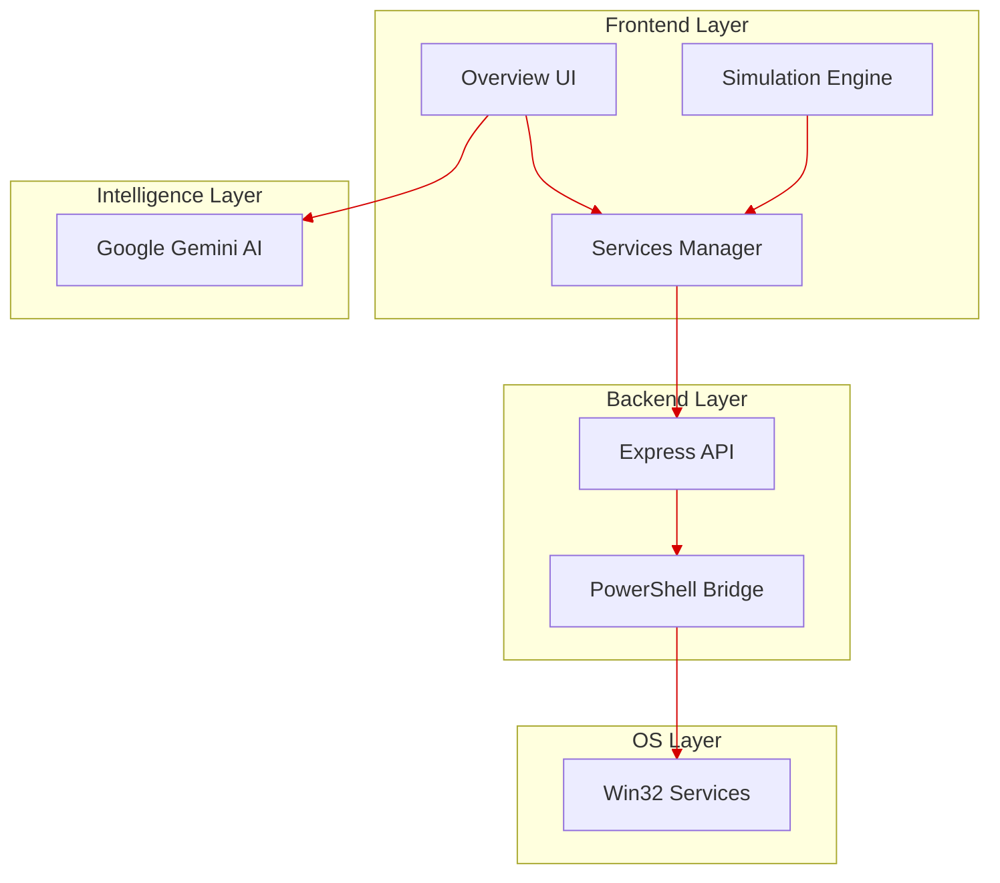

# 🛰️ UptimeSHIELD | Technical Architecture

> **High-Availability Monitoring and Automated Service Recovery for Windows**

---

## 🚀 Getting Started

To start the entire system (Frontend + Backend) with zero-configuration:

1.  **Install Dependencies**:
    ```bash
    npm run install:all
    ```

    > **Clean Install**: If you need to reset the project, use `npm run uninstall:all` to remove all dependencies and artifacts before re-installing.

2.  **Start Development**:
    ```bash
    npm run dev
    ```
    - **Zero-Config**: The `predev` hook automatically runs `ensure-certs.ps1`.
    - **Auto-Certs**: Certificates (PEM/PFX) are generated on-the-fly if missing.
    - **Endpoints**:
        - **Frontend**: `https://localhost:3000`
        - **Backend**: `https://localhost:3001`


3.  **Production Deployment**:
    ```bash
    npm run build
    npm start
    ```
    - **Architecture**:
        - `vite build` compiles the React app into the static `/dist` folder.
        - `node server/server.js` starts the Express server.
        - **Static Serving**: The Express server is configured to serve the contents of `/dist` as static assets.
        - **Client-Side Routing**: A catch-all route (`*`) in Express ensures that all non-API requests are directed to `index.html`, enabling proper React Router behavior.
    - **Benefits**:
        - Eliminates the "Using Development Build" warning from React.
        - Optimized asset minification and bundling for performance.
        - Single-process execution (only Node.js needed, no separate Vite server).
    - **Endpoints**:
        - **Frontend**: `https://localhost:3000`
        - **Backend**: `https://localhost:3001`

---

## ⌨️ Manual Setup & Configuration

### 🔑 Manual Certificate Setup
If you prefer to use your own certificate:
1. Place your **`cert.pfx`** file in the `server/certs/` directory.
2. Ensure the **`certPassword`** in your global `config.json` matches the password of your PFX file.
3. The system will automatically detect and use this file on the next start.

---

## 🔒 Security Layer (HTTPS Toggle)

The system supports a dynamic security layer that can be toggled using environment variables.

-   **Environment Variable**: `USE_HTTPS` (defaults to `false`). Set to `false` for standard HTTP (no encryption).
-   **Automation Script**: [`ensure-certs.ps1`]
    -   **Execution Strategy**: Prioritizes OpenSSL (via Git Bash/System Path). Falls back to native `New-SelfSignedCertificate` on Windows systems.
    -   **PFX Conversion**: Automatically packages PEM files into a `.pfx` container.
    -   **Enterprise Password Management**: Generates 16-character strong passwords. Passwords are ahora stored in the global `config.json` for system-wide persistence.
    -   **Auto-Cleanup**: Automatically removes legacy `UptimeSHIELD` certificates from the Windows Trusted Root and Personal stores during regeneration.
    -   **Silent Integration**: Detects Administrator elevation to silently install certificates into the `LocalMachine` store, eliminating recurring security prompts.
-   **Server Logic**:
    -   **Backend**: `server.js` initializes `https` using the `certPassword` from `config.json`.
    -   **Encoded Execution**: Uses Base64-encoded PowerShell commands (`-EncodedCommand`) to safely handle complex passwords with special characters.
    -   **Maintenance Service**: A background interval (every 24h) triggers the security engine to check for upcoming expirations and auto-renew if the toggle is active.

---

## ⚙️ Environment Management

The application uses `dotenv` to manage configurations across different environments.

-   **Priority**: `.env.local` variables take precedence over `.env`.
-   **Security**: All sensitive credentials (like `GEMINI_API_KEY`) MUST be stored in `.env.local`.
-   **Structure**: 
    -   `USE_HTTPS`: Master toggle for secure communication.
    -   `GEMINI_API_KEY`: Required for the AI-powered diagnostic features.

```env
GEMINI_API_KEY=PLACEHOLDER_API_KEY
```

---

## 🏗️ System Architecture [https://mermaid.live/]
 -  Frontend Layer (Vite + React)
 - Backend Layer (Node.js + Express)
 - OS Layer (Windows)
 - Intelligence Layer


```mermaid
graph TD
  subgraph subGraph0["Frontend Layer"]
        UI["Overview UI"]
        Manager["Services Manager"]
        SIM["Simulation Engine"]
  end

  subgraph subGraph1["Backend Layer"]
        API["Express API"]
        PS["PowerShell Bridge"]
  end

  subgraph subGraph2["OS Layer"]
        Services["Win32 Services"]
  end

  subgraph subGraph3["Intelligence Layer"]
        Gemini["Google Gemini AI"]
  end

    UI --> Manager
    Manager --> API
    API --> PS
    PS --> Services
    SIM --> Manager
    UI --> Gemini

    linkStyle 0 stroke:#D50000,fill:none
    linkStyle 1 stroke:#D50000,fill:none
    linkStyle 2 stroke:#D50000,fill:none
    linkStyle 3 stroke:#D50000,fill:none
    linkStyle 4 stroke:#D50000,fill:none
    linkStyle 5 stroke:#D50000,fill:none
```

---

## 🎨 Atomic Design System Architecture

The UptimeSHIELD UI is built on a strict **Atomic Design** philosophy, centralized within the `components/ui` directory. This ensures visual consistency and rapid development.

### 🧩 Atoms (Primitives)
These are stateless, reusable components that form the building blocks of the application. They are designed to be "dumb" regarding business logic but "smart" regarding theming and interactivity.

| Atom | Description | Features |
| :--- | :--- | :--- |
| **Button** | Interactive triggers | Multi-variant (primary, ghost, danger), Loading states, Icon support. |
| **Card** | Content containers | Standardized padding, borders, and background opacity. |
| **Badge** | Status indicators | Animated pulses for active states, semantic coloring (Safety/Danger). |
| **Input** | Data entry | Floating labels, error state handling, focus management. |
| **Modal** | Overlays | Full-screen blurred backdrop, scroll locking, z-index management. |
| **Table** | Structured data | Responsive container, hoverable rows, modular layout components. |
| **Alert** | Status feedback | Multi-variant (Success/Danger/Info/Warning), SVG icon support. |
| **Switch** | Binary toggle | Smooth transitions, multi-variant colors, focus management. |
| **Toast** | Notifications | Fixed positioning, high z-index (100), automated entry animations. |
| **NavButton** | Navigation triggers | Active state indicators, icon support, glassmorphism hover effects. |

### 🏗️ Composition Strategy
- **Molecules**: Atoms are combined to form functional units (e.g., a `SearchInput` combines `Input` + `Icon`).
- **Organisms**: Complex sections like the `ServiceManager` table row.
- **Templates**: The high-level page layouts (`Overview.tsx`, `Services.tsx`).

> **Dev Note**: When adding new UI features, always check `components/ui` first. Do not introduce raw HTML/Tailwind classes for buttons or inputs; use the atoms to maintain the "Command Center" aesthetic.

---

## 📊 Core Inventory

| Module | Purpose | File |
| :--- | :--- | :--- |
| **Logic Hub** | Global state & Simulation engine | [App.tsx] |
| **Admin Panel** | CRUD, Import/Export & Discovery | [Services.tsx] |
| **Service Bridge** | OS-level PowerShell execution | [server.js] |
| **AI Diagnostics** | Gemini Flash 2.5 Log Analysis | [AIAnalysisModal.tsx] |
| **System Config** | Settings & Notifications | [Configuration.tsx] |

---

## 🔍 Detailed Component Analysis

### 📡 **Backend: The PowerShell Bridge**
#### `server.js`
The backend acts as a specialized gateway. It uses Node's `child_process` to pipe requests directly into the Windows Management Instrumentation (WMI) via PowerShell.
- **Dynamic Enumeration**: On-demand scanning of all installed Win32 services via WMI.
- **Buffering**: Optimized `maxBuffer` (100MB) handling to process large output from massive system service pools.
- **Security Context**: Executes PowerShell commands using `utf16le` encoding to ensure cross-platform compatibility with special characters.
- **Background Workers**: Manages recurring tasks like certificate health checks and auto-renewals independently of the request/response cycle.

### 🧠 **Frontend: The Orchestration Layer**
#### `App.tsx`
This is the "Brain" of the application.
- **Heartbeat Loop**: Runs a continuous monitoring check (adjustable interval) to verify service health.
- **Recovery Logic**: Automatically transitions services from `FAILED` to `RESTARTING` based on configured thresholds.
- **Mobile Responsive Drawer**: Implements a dedicated sidebar that collapses into a smart navigation drawer on mobile dispositivos.
- **State Persistence**: Persists user preferences like `activeView` and monitoring settings to `localStorage` for continuity across sessions.

#### `Services.tsx`
A robust interface for service lifecycle management.
- **Smart Filtering**: The `filterExternalServices` function applies a whitelist/blacklist approach:
    - **Hidden Paths**: `C:\Windows`, `C:\Program Files`, `C:\ProgramData`.
    - **Rationale**: To reduce "system noise" and focus exclusively on user-installed applications.
- **Bulk Actions**: Support for importing complex monitoring topologies via JSON.
- **Data Integrity**: Built-in duplicate detection logic prevents redundant entries during both "Smart Fetch" and manual addition.
- **Micro-Interactions**: Replaced native imperative `alert()` calls with a declarative, state-driven Toast notification system (`z-[100]`) that floats above all layers (including Modals).

#### `Overview.tsx` & `Logs.tsx`
The visualization suite.
- **Mini Sparklines**: `Overview` uses high-performance `LineChart` (Recharts) to show real-time uptime trends for the top 5 services with status-aware glow effects.
- **Metrics Aggregation**: Real-time aggregation of uptime percentages and failure counts using `useMemo` for performance.
- **Event Stream**: A scroll-synced log terminal with built-in hooks for AI analysis and semantic log-level filtering.

#### `Configuration.tsx`
The central control panel for system behavior.
- **Notification Engine**: Manages SMTP relay settings for critical alerts.
- **Threshold Tuning**: Configures the `checkInterval` and `autoRestart` resilience policies.
- **Sectional Synchronization**: Implements separate sync logic for "Email" and "Monitoring Engine" settings, fetching the latest server state before merging to prevent race conditions or accidental overwrites of unrelated fields.
- **Live Security Dashboard**: Displays real-time metadata from the active certificate, including thumbprint, issuer, and days until expiration.

---

## ⚡ Data Flow Pipeline

1.  **Detection**: `Services` calls `server.js` ➡️ PowerShell scans the OS.
2.  **Mapping**: Raw OS data is transformed into the typed `Service` object.
3.  **Monitoring**: `App.tsx` triggers the simulation/check loop.
4.  **Recovery**: If a failure is detected, the `autoRestart` logic attempts 1-10 retries.
5.  **Analysis**: Complex failures are analyzed by **Gemini AI** to provide human-readable solutions.

---

## 🏷️ Type Safety
#### `types.ts`
The project is built on a "Type-First" philosophy. Every state transition (from `RUNNING` to `FAILED`) is strictly governed by the `ServiceStatus` enum, ensuring zero-runtime errors in the state machine.
